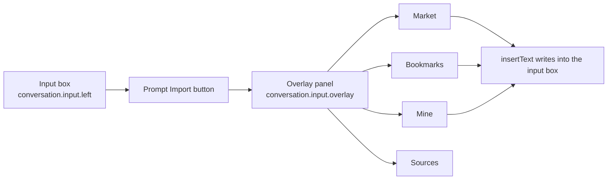
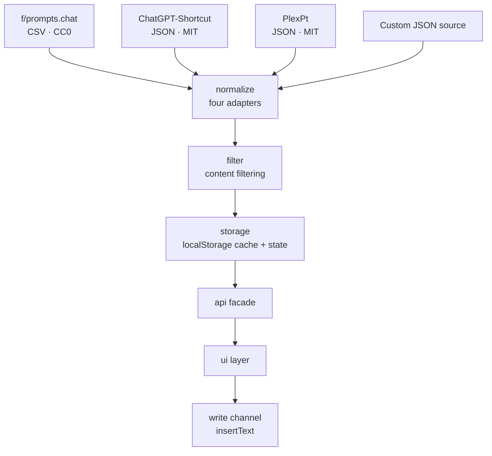

<div align="center">

# dsh-prompt-market

**Prompt market plugin for DeepSeek Harness**

Browse, search, and bookmark prompts from the chat box — pick one and it goes straight into your input box

[](LICENSE)
[](CHANGELOG.md)
[](https://www.npmjs.com/package/dsh-prompt-market)
[](#installation)
[](#why-there-is-no-build-step)
[](#data--privacy)

[简体中文](README.md) | **English** | [日本語](README-ja.md)

</div>

---

## Table of Contents

- [Preview](#preview)
- [What Problem It Solves](#what-problem-it-solves)
- [Features](#features)
- [UI & Architecture](#ui--architecture)
- [Installation](#installation)
- [Quick Start](#quick-start)
- [Configuration](#configuration)
- [Data & Privacy](#data--privacy)
- [Built-in Sources & Licenses](#built-in-sources--licenses)
- [Adding Custom Sources](#adding-custom-sources)
- [FAQ](#faq)
- [Directory Structure](#directory-structure)
- [Development & Self-checks](#development--self-checks)
- [Status & Known Limitations](#status--known-limitations)
- [Roadmap](#roadmap)
- [Contributing](#contributing)
- [License](#license)

---

## Preview

### Market: browse, search, and bookmark all inside one overlay


The three built-in sources hold **2527 entries** in total (after content filtering).

Search across **title / description / body / tags** at the top, with category and sort options on the right; each entry carries **Insert / Replace / Details / ★**.
The footer shows the source, language, license, and tags for whatever is currently listed.

### Sources: connectivity, licenses, and attribution at a glance


Two details worth noticing:

- The **Status** column shows how many entries each source actually loaded — a failed connection is **reported honestly**; it never quietly pretends to have succeeded
- The **License** column keeps the two MIT libraries **distinct**: one is `MIT`, the other is `MIT-plexpt`
  (**two libraries with different copyright holders, so attribution is never mixed together**)

### Mine: write your own, edit your own


Your own prompts live on your machine — edit them, delete them, or export them to take with you.

### Bookmarks: always within reach


### Adding a custom source (with a collapsible guide)


The guide explains **how to tell whether a URL will work at all** (what you see has to be raw data containing `{}` / `[]`,
not a nicely rendered web page), and gives examples you can copy verbatim.

### Content filter and write diagnostics


The content filter is **on by default**: all six rules can be toggled one by one, and you can add custom blocked words.
The **Insert field** setting switches between the **Chinese description** and the **English original**.

---

## What Problem It Solves

When you write with AI, the prompts that actually work end up scattered across browser bookmarks, notes, and other people's chat logs. When you need one, you either can't find it, or you paste it and spend the next ten minutes fixing it up.

This plugin compresses **finding a prompt → using a prompt** into two steps:

```
点输入框左边的「提示词导入」  →  点某一条的「插入」
```

---

## Features

| Module | What it does |
|---|---|
| 🛒 **Market** | Three built-in sources, with search, category filters, pagination, and weighted ranking; shows source and license |
| ⭐ **Bookmarks** | One-click bookmark / unbookmark; bookmarks get their own tab, always within reach |
| ✍️ **Mine** | Create, edit, and delete your own prompts, with tags |
| 🔌 **Sources** | Per-source connectivity and cache entries; **add any JSON source** (with a collapsible guide); shows license and attribution |
| 🛡️ **Content filter** | On by default; blocks jailbreak-style and adult role-play entries; six rules you can toggle one by one, plus custom blocked words |
| 💾 **Import / export** | Exports bookmarks + custom prompts + tags + settings as a single JSON file, for moving to a new machine |
| 🈶 **Chinese / English switch** | **Inserts the Chinese description by default**; switch to the English original in Sources |

### Insertion behavior

- **Inserts the Chinese description by default** (`description`) — easier to read and to edit afterwards
- Switch to the **English original** (`prompt`) under **Sources → Advanced → Insert field**
- Insertion goes through `inputActions.insertText()`, so **`Ctrl+Z` undoes it**
- If the input box already has content, the text is **inserted at the cursor** by default; nothing you've written is overwritten
- To replace the whole draft: `Ctrl+A` to select it, then click **Replace**

> ⚠️ **What the API can and cannot do (stated plainly)**
>
> The plugin's `InputActions` exposes only `captureInsertion` / `insertText` / `setDraft` — **it cannot clear the draft or set a selection**.
> So "replace the whole draft" depends on you selecting it manually; the plugin **cannot clear your draft on its own**.
> That is the current boundary of the DSH interface, not a trade-off this plugin made.

---

## UI & Architecture

### UI composition



The UI hangs off two official DSH slots. It doesn't intrude on the conversation area, and it doesn't rewrite any other plugin's UI.

### Data flow



**Fallback chain**: network failure → use the local cache → no cache either → return a displayable error state. **No blank screen, no uncaught exception.**

---

## Installation

### Prerequisites

- The DeepSeek Harness desktop app
- The plugin **needs no Node at runtime** (Node is only required for the development self-checks)

### ⚠️ First: are you typing into the **dialog**, or running a **terminal** command?

The two take **different things**:

| Where | What to enter |
|---|---|
| DSH's **Settings → Plugins → Add plugin** dialog | **Only the identifier** (package name / URL / directory path) |
| A Windows **terminal** (cmd / PowerShell) | The **full command** `dsh plugin --profile desktop add <identifier>` |

> 🔴 **The most common mistake**: pasting the whole `dsh plugin --profile desktop add https://...`
> line into the dialog. You get
> **"无法识别这个包名或地址: not a package name the registry accepts"**.
> The dialog must **not** include the leading `dsh plugin --profile desktop add`.

---

### Option 1: One-line command (recommended, published to npm)

**① In the dialog, enter only this line:**

```
dsh-prompt-market
```

**② Or run this in a terminal:**

```cmd
dsh plugin --profile desktop add dsh-prompt-market
```

> ✅ **No `git` needed**, and no URL to remember.
> Published on npm: <https://www.npmjs.com/package/dsh-prompt-market>
>
> 🌏 **On a restricted network**: in the "Add plugin" dialog, set the **install source** (「安装源」) to the
> **Chinese mainland mirror** (npmmirror), and it will install from the domestic mirror.
>
> 💡 If npm cannot install it (offline, blocked, registry unreachable),
> switch to **Option 2** below (direct release-asset link).

### Option 2: Direct release-asset link (no git needed, fallback)

**① In the dialog, paste:**

```
https://github.com/yi-yezhiqiu/dsh-prompt-market/releases/latest/download/dsh-prompt-market.tgz
```

**② Or run this in a terminal:**

```cmd
dsh plugin --profile desktop add https://github.com/yi-yezhiqiu/dsh-prompt-market/releases/latest/download/dsh-prompt-market.tgz
```

> ✅ **This one does not depend on `git` either** — it downloads the release asset directly (measured at a few seconds).
> Good for fully offline setups or when the registry is unreachable.
>
> 📌 The `latest` in that URL is resolved by GitHub at request time and **always points at the newest release**,
> so this link stays valid.

### Option 3: Install from the GitHub repository (requires git)

**① In the dialog, paste:**

```
github:yi-yezhiqiu/dsh-prompt-market
```

(`https://github.com/yi-yezhiqiu/dsh-prompt-market` works too)

**② Or run this in a terminal:**

```cmd
dsh plugin --profile desktop add github:yi-yezhiqiu/dsh-prompt-market
```

> ⚠️ **This form requires `git` to be installed** — pnpm shells out to it to fetch the repository.
> Without it you get:
>
> ```
> [ERROR] Command failed with exit code 1: git ls-remote "https://github.com/..."
> 'git' is not recognized as an internal or external command
> ```
>
> **If you hit that, switch to Option 1 or Option 2**, or install git first (`winget install Git.Git`).

### Option 4: Install from a local directory

Clone first (or download and unzip the repository), then install that directory:

```cmd
git clone https://github.com/yi-yezhiqiu/dsh-prompt-market.git
dsh plugin --profile desktop add "<the directory you just cloned>"
```

If `dsh` isn't on your PATH, use the shim inside the DSH installation directory:

```cmd
"<DSH install dir>\resources\runtime\cli\bin\dsh.cmd" plugin --profile desktop add "<directory>"
```

### Option 5: Symlink (developers)

```cmd
mklink /D "<DSH profile>\node_modules\dsh-prompt-market" "<repository path>"
```

After that, changing the code **only needs a DSH restart — no reinstall**.

> 🔄 **After installing, quit DSH completely and open it again** — profiles are loaded at startup.
>
> ℹ️ DSH installs plugins through **pnpm** under the hood. This package ships **no `prepare` build script**,
> so you do not need an `allowBuilds` entry in `pnpm-workspace.yaml`.

### Verify the installation

Once DSH is back up, a **Prompt Import** button (「提示词导入」) should appear on the left side of the input box. Click it and you should get four tabs.

---

## Quick Start

1. Click **Prompt Import** (「提示词导入」) on the left side of the input box
2. On the **Market** tab, search for the scenario you want (e.g. "writing", "translation", "code review")
3. Click **Insert** on the right of an entry — the text lands in the input box
4. Add whatever detail you need, then send
5. For prompts you use often, click ⭐ to **bookmark** them and grab them from the **Bookmarks** tab next time
6. For prompts you write yourself, create and save them on the **Mine** tab

---

## Configuration

Everything here lives on the **Sources** tab (「源管理」):

| Setting | Default | Notes |
|---|---|---|
| **Insert field** (「写入字段」) | Chinese description (`description`) | Can be switched to the English original (`prompt`) |
| **Content filter** (「内容过滤」) | On | Blocks jailbreak-style and adult role-play entries |
| **Filter rules** (「过滤规则」) | All six on | Each one can be turned off individually |
| **Custom blocked words** (「自定义屏蔽词」) | Empty | Any entry that matches gets filtered out |
| **Per-source enablement** (「每个源的启用状态」) | All enabled | Temporarily disable a single source |
| **Cache lifetime** (「缓存有效期」) | See `NET_DEFAULTS` in the source | Refetched once it expires |

---

## Data & Privacy

| Item | Notes |
|---|---|
| **Storage** | Browser `localStorage` (key prefix `dsh-prompt-market:`) |
| **Anything uploaded?** | ❌ **No data is uploaded** — no account, no server |
| **Anything written to disk?** | ❌ No (apart from the plugin's own code) |
| **On corrupted data** | The original data is moved into `quarantine` and kept — it is **never wiped outright** |
| **When `localStorage` is unavailable** | Falls back to in-memory mode (everything still works, but is lost on restart); the UI tells you |
| **Diagnostics log** | Records only the **length and hash** of a draft, never its contents |
| **Where requests go** | Only to the URLs you can see in your source list (built-in sources use `cdn.jsdelivr.net` by default) |

**Uninstalling does not clear your data.** To wipe it clean, delete the keys with the `dsh-prompt-market:` prefix in your browser dev tools.

---

## Built-in Sources & Licenses

| Source | License | Notes |
|---|---|---|
| [f/prompts.chat](https://github.com/f/prompts.chat) | **CC0 1.0** | The classic English prompt library, public domain |
| [rockbenben/ChatGPT-Shortcut](https://github.com/rockbenben/ChatGPT-Shortcut) | **MIT** | Chinese library; `prompt` is mostly the English original, with the Chinese in `description` |
| [PlexPt/awesome-chatgpt-prompts-zh](https://github.com/PlexPt/awesome-chatgpt-prompts-zh) | **MIT** | A purely Chinese library — titles and bodies are both in Chinese |

Full copyright lines and license texts are in **[THIRD-PARTY-NOTICES.md](THIRD-PARTY-NOTICES.md)**.

> 📌 **Content is not shipped with the package.** At runtime the plugin pulls these sources from a CDN and caches them on your machine;
> this repository **contains no** upstream prompt content.

---

## Adding Custom Sources

Under **Sources → Add custom source**, paste the URL of anything that returns a **JSON array**, and the plugin will recognize the common field names on its own:

| Purpose | Auto-detected field names |
|---|---|
| Title | `title` / `act` / `name` / `label` / `prompt_title` |
| Body | `prompt` / `content` / `body` / `text` / `value` |
| Tags | `tags` |
| Nested structures | Automatically takes "the first array whose elements are objects"; you can also specify `listPath` |

**For JSON hosted on GitHub, use the jsDelivr mirror** (`raw.githubusercontent.com` is unreachable on some networks):

```
https://cdn.jsdelivr.net/gh/<用户名>/<仓库名>@main/<文件路径>.json
```

> The add form includes a **collapsible, detailed guide** that covers the criteria, examples, and common pitfalls.

---

## FAQ

<details>
<summary><b>It inserted English and I can't read it</b></summary>

What gets inserted by default is actually the **Chinese description** (「说明」). If some entries have an empty Chinese description, the plugin falls back to the English original.

Check the current setting under **Sources → Advanced → Insert field**, or rewrite the prompt in Chinese on the **Mine** tab and save it.
</details>

<details>
<summary><b>Will inserting overwrite what's already in the input box?</b></summary>

**No.** By default the text is inserted at the cursor, and what you've already written stays put.

To replace the whole draft: `Ctrl+A` to select it, then click **Replace**.
</details>

<details>
<summary><b>Can I undo a bad insert?</b></summary>

**Yes — `Ctrl+Z`.** Insertion goes through the channel DSH officially describes as "undoable plain-text editing".
</details>

<details>
<summary><b>If I close the panel, is my half-written draft still there?</b></summary>

**It is.** The panel is an overlay; it never touches your draft.
</details>

<details>
<summary><b>Does this plugin upload my stuff anywhere?</b></summary>

**No.** It only sends GET requests to the addresses in your source list, to fetch prompt data. Your bookmarks, custom prompts, drafts, and everything else **never leave your machine**.
The diagnostics log records lengths and hashes only, never content.
</details>

<details>
<summary><b>I added a custom source but not a single entry loads</b></summary>

Check these in order:

1. Does the URL return a **JSON array**? (Not an object, not an HTML page.)
2. Are you using `raw.githubusercontent.com`? Switch to the `cdn.jsdelivr.net` mirror.
3. Is the field name on the auto-detection list? If not, set `listPath` in the source config.
4. Are the entries being caught by the **content filter**? (The Sources tab shows the filter count.)
</details>

<details>
<summary><b>One prompt got filtered by mistake</b></summary>

Go to **Sources → Content filter** and turn rules off one at a time, or remove that entry's keyword from your custom blocked words.
</details>

<details>
<summary><b>If I switch computers, do my bookmarks come with me?</b></summary>

Use **Import / export** to export your data as JSON and take it along, then import it on the new machine. The data lives in the browser's `localStorage`, so it isn't tied to any account.
</details>

<details>
<summary><b>Will uninstalling delete my bookmarks?</b></summary>

Not automatically (`localStorage` is independent of the plugin). To wipe them clean, delete the keys with the `dsh-prompt-market:` prefix in dev tools.
</details>

---

## Directory Structure

```
(The repository root IS the package root — this is where pnpm looks for package.json)

package.json                 package metadata: dsh.bundle.patch + dsh.client
cordis.patch.yml             profile-layer patch (a single insert mounts this plugin)
index.js                     Host half (ESM)
client.js                    ★ browser half (assembled artifact — the only client entry DSH loads)
core/                        data layer
├── *.js                     9 independently readable units
├── browser.js                browser-half source (no build step; inlined verbatim)
├── selftest-node.js          data-layer self-test (runs under Node)
└── check-data-layer.ps1      static self-test (no JS runtime needed)
ui/                          interface layer
├── 00-core.js … 80-client-shell.js
├── check-ui.ps1              static UI self-test
└── DESIGN.md                 UI design contract
lib/write-draft.js           low-level write wrapper (probes / diagnostics only)

README.md / README-en.md / README-ja.md     documentation (3 languages)
docs/DEVELOPMENT.md          development & assembly notes
docs/images/                 screenshots
CHANGELOG.md                 changelog
CONTRIBUTING.md              contributing guide
THIRD-PARTY-NOTICES.md       upstream licences & attribution
LICENSE                      MIT
.github/ISSUE_TEMPLATE/      issue templates
```

### Why there is no build step

`client.js` is **assembled** from the **9 data units** in `core/browser.js` plus the **8 UI units** in `ui/`, following the template in `ui/80-client-shell.js`.

The UI code is hand-written in the `window.__ModuleLoader__.load({ id, factory })` form — **no bundler, no JSX, no TypeScript**. The source is the artifact, which is why the assembled output is under version control too.

---

## Development & Self-checks

```cmd
:: syntax check (every .js in the repo; assembly fragments are skipped automatically)
node check-syntax.js

:: authoritative criterion: assembled region vs. browser.js unit regions, line by line
node core/build-client-bundle.js --check

:: data-layer self-test (runs the real algorithms)
node core/selftest-node.js

:: data-layer static self-test (structural assertions, no JS runtime needed)
powershell -NoProfile -ExecutionPolicy Bypass -File core/check-data-layer.ps1

:: UI static self-test
powershell -NoProfile -ExecutionPolicy Bypass -File ui/check-ui.ps1
```

> ⚠️ **The consistency check only ever compares section against section**: the `PM-CORE-INLINE` section of
> `client.js` ↔ the unit sections of `browser.js`, line by line (ignoring leading indentation and blank lines).
> **Do not** diff the whole `client.js` against the whole `browser.js` (the former is an assembled artifact that also contains the shell and UI sections, so their lengths are unrelated from the start),
> and **do not** diff `browser.js` against `core/*.js` (the unit bodies are a trimmed rewrite, so a line-by-line diff is guaranteed to produce false positives).

---

## Status & Known Limitations

This project has been through an independent review (three rounds, all blockers closed) and hands-on testing on a real machine. The following is **stated plainly**:

### ✅ Verified on a real machine

Button visible · Four panel tabs · **Inserts Chinese** · **Text can be sent after insertion** · **Draft survives closing the panel** ·
**`Ctrl+Z` undoes the insert** · Insert-field switch · Detail close · Custom-source guide · **License and attribution shown per source** ·
Package installability (`pack.ps1` / `verify-package.ps1` exit code 0) · All static self-checks exit code 0 ·
**Per-entry parsing of all three built-in sources** — raw counts `prompts-chat-csv` **2165** / `chatgpt-shortcut-zh` **279** /
`plexpt-prompts-zh` **124**, which after content filtering come to **2140 / 267 / 120**, for a total of **2527**

> That last item was **cross-checked along two independent paths**: the data layer run on the Node side (`verify-sources.js`),
> and the counts the real UI displayed — the two match exactly.

#### 📦 Installation path: verified on a **third party's machine** (not the maintainer's self-test)

| | |
|---|---|
| Verified by | **Another user** (not the maintainer) |
| Machine | A **different machine and a different DSH data directory** |
| Method | **Option 1: the release asset** (that machine had **no `git` installed**) |
| Result | ✅ **Installed successfully** |

> This item sat in "not runtime-verified" for a long time, and it exposed **two real defects** —
> **both found only because someone else tried it**:
>
> 1. In `v0.1.0` the package root lived under `plugin/`, so installing **from the repository URL failed**.
> 2. The docs said "requires `git`" but **never offered a way around it**, shutting out anyone without git.
>
> **The maintainer's own machine passing ≠ other people being able to install it.** This note stays here to remind whoever comes next.

### 🟨 Not runtime-verified (design is sound, but there is no runtime evidence)

Offline fallback · Bookmarks and custom prompts persisting across restarts · Content filtering actually firing on real Chinese entries at runtime ·
The conditional **Replace** action

> These are **not "broken" — they are "never verified"**. We don't write them up as verified.

### 🔴 A real defect found after delivery, and fixed

| Defect | Consequence | Status |
|---|---|---|
| The remote response-body limit of **4 MB** was too small, while the built-in English source's CSV is actually **5.5 MB**, so the entire payload was discarded | **The English source could not load a single entry (0 entries)** — one of the three built-in sources was broken | ✅ Fixed (limit raised to 12 MB); confirmed on a real machine back up to **2140 entries** |

> This defect **landed squarely inside the "not runtime-verified" list above** (the item formerly called "complete per-entry parsing of all three sources"),
> and it was **found by the user's screenshot of the real UI, not by any self-check script**.
>
> The original code comment read "to keep an 8 MB-class file from dragging the editor down; decided to avoid it" —
> in other words, the design **assumed every built-in source was a small file**. Runtime evidence disproved that assumption.
>
> **That is what the words "not runtime-verified" really mean: not "probably fine", but "might genuinely be broken".**

### Known limitations

| # | Detail |
|---|---|
| L1 | `selftest-node.js` includes one ~78-second case (the production default timeout budget isn't injectable, and the core was left untouched) |
| L2 | A few self-check assertions need a re-run to settle in environments without `localStorage` |
| L3 | `client.js` keeps 2 placeholder comment lines from the assembly template, so the UI self-check `A14` reports a **WARN** (not a FAIL, no functional impact) |
| L4 | "Replace the whole draft" depends on you selecting it with `Ctrl+A` — a boundary of the DSH `InputActions` interface |

---

## Roadmap

- [ ] Prompt variable filling (`{{variable}}` placeholders and a fill-in panel)
- [ ] Bookmark groups / folders
- [ ] Support Gitee and any CORS-friendly JSON source
- [ ] Built-in sources that can be added, removed, and reordered
- [ ] Clear the UI self-check `A14` WARN (handled together with the next assembly)

> The roadmap is a **plan**, not a promise. If something matters to you, open an issue.

---

## Contributing

Issues and PRs are welcome — please read [CONTRIBUTING.md](CONTRIBUTING.md) first.

**Especially welcome**:

- 🐛 Real-world results for the scenarios on the **not-runtime-verified list** (pass or fail, both are useful)
- 🌐 More built-in prompt sources (please include the **upstream license** and **copyright holder**)
- 🌍 README translations (currently Chinese, English, and Japanese)

---

## License

The plugin code is released under the **MIT** license; see [LICENSE](LICENSE).

Licenses and attribution for the built-in data sources are in [THIRD-PARTY-NOTICES.md](THIRD-PARTY-NOTICES.md) —
**please keep them with the plugin if you distribute or modify it.**

<div align="center">

**If this plugin helped you, a ⭐ is the best way to say thanks**

</div>
