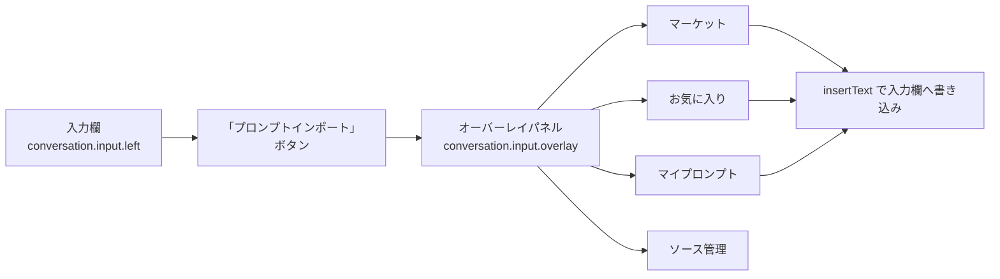
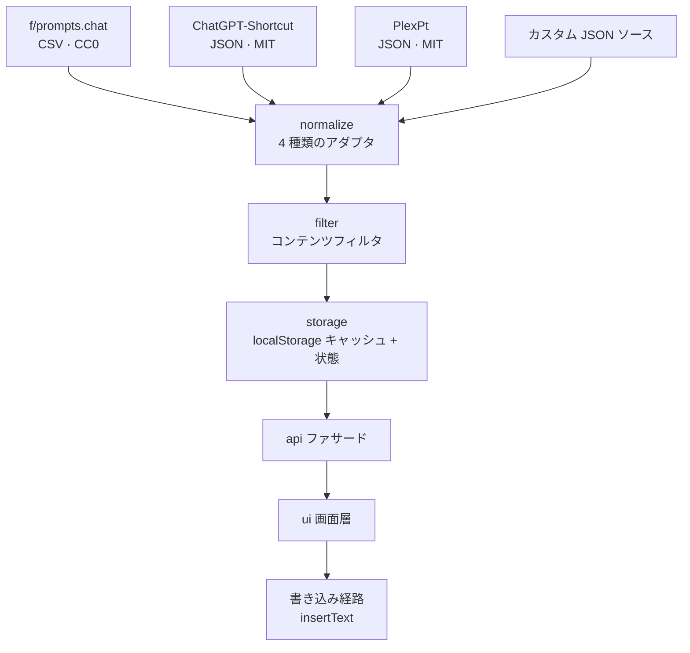

<div align="center">

# dsh-prompt-market

**DeepSeek Harness プロンプトマーケットプラグイン**

対話欄からワンクリックでプロンプトを閲覧・検索・お気に入り登録 —— 選んだ内容がそのまま入力欄に入ります

[](LICENSE)
[](CHANGELOG.md)
[](#インストール)
[](#ビルド手順が不要な理由)
[](#データとプライバシー)

[简体中文](README.md) | [English](README-en.md) | **日本語**

</div>

---

## 目次

- [プレビュー](#プレビュー)
- [解決する課題](#解決する課題)
- [主な機能](#主な機能)
- [画面とアーキテクチャ](#画面とアーキテクチャ)
- [インストール](#インストール)
- [クイックスタート](#クイックスタート)
- [設定項目](#設定項目)
- [データとプライバシー](#データとプライバシー)
- [組み込みソースとライセンス](#組み込みソースとライセンス)
- [カスタムソースの追加](#カスタムソースの追加)
- [よくある質問](#よくある質問)
- [ディレクトリ構成](#ディレクトリ構成)
- [開発とセルフチェック](#開発とセルフチェック)
- [検証状況と既知の制限](#検証状況と既知の制限)
- [ロードマップ](#ロードマップ)
- [コントリビュート](#コントリビュート)
- [ライセンス](#ライセンス)

---

## プレビュー

### マーケット：1 つのオーバーレイで閲覧・検索・お気に入り登録


組み込みソース 3 種で合計 **2527 件**（コンテンツフィルタで除外した件数を差し引いた数）。

上部では**タイトル / 説明 / 本文 / タグ**を検索でき、右側ではカテゴリと並び順を選べます。各項目の右側に並ぶのは「挿入 / 置換 / 詳細 / ★」。
下部には、いま表示している一覧の出典・言語・ライセンス・タグがリアルタイムで表示されます。

### ソース管理：接続性・ライセンス・クレジットが一目でわかる


注目すべき点が 2 つあります：

- 「**状態**」列には、各ソースが実際に何件読み込んだかが表示されます —— 接続に失敗すれば**正直にエラーを報告**し、黙って成功したふりをすることはありません
- 「**ライセンス**」列は 2 つの MIT ライブラリを**区別して**扱います：一方は `MIT`、もう一方は `MIT-plexpt`
  （**著作権者が異なる 2 つのライブラリであり、クレジットを混用しません**）

### マイプロンプト：自分で書き、自分で直す


自作のプロンプトは端末内に保存され、編集も削除もでき、エクスポートして持ち出すこともできます。

### お気に入り：いつでも取り出せる


### カスタムソースの追加（折りたたみ式の説明書付き）


説明書では、**ある URL が使えるかどうかをどう判断するか**（表示されるのが `{}` / `[]` を伴う生データであり、整形されたウェブページではないこと）が説明されており、そのまま真似できる例も用意されています。

### コンテンツフィルタと書き込み診断


コンテンツフィルタは**既定で有効**で、6 つのルールを 1 つずつオン・オフでき、独自のブロックワードも追加できます。
「書き込みフィールド」は**中国語の説明文**と**英語の原文**の間で切り替えられます。

---

## 解決する課題

AI で文章を書いていると、役に立つプロンプトはブラウザのブックマーク、メモ、他人のチャットログなど、あちこちに散らばっています。いざ使おうとすると見つからなかったり、コピーしても結局は手直しが必要だったりします。

このプラグインは「**プロンプトを探す → プロンプトを使う**」を 2 ステップに短縮します。

```
点输入框左边的「提示词导入」  →  点某一条的「插入」
```

---

## 主な機能

| モジュール | できること |
|---|---|
| 🛒 **マーケット** | 組み込みソース 3 種。検索、カテゴリ絞り込み、ページ送り、重み付けソートに対応。出典とライセンスを表示 |
| ⭐ **お気に入り** | ワンクリックで登録・解除。お気に入り専用のタブにまとまり、いつでも取り出せます |
| ✍️ **マイプロンプト** | 自作プロンプトの新規作成・編集・削除。タグ付けも可能 |
| 🔌 **ソース管理** | 各ソースの接続状態とキャッシュ件数を確認。**任意の JSON ソースを追加**（折りたたみ式の説明書付き）。ライセンスとクレジットを表示 |
| 🛡️ **コンテンツフィルタ** | 既定で有効。脱獄（ジェイルブレイク）系とアダルトなロールプレイの項目を遮断。6 つのルールは個別にオン・オフでき、独自のブロックワードも設定可能 |
| 💾 **インポート・エクスポート** | お気に入り + 自作プロンプト + タグ + 設定をまとめて JSON に書き出し。マシンの移行が簡単 |
| 🈶 **中国語・英語の切り替え** | **既定では中国語の説明文を挿入**。ソース管理から英語の原文に切り替えられます |

### 書き込みの挙動

- **既定では中国語の説明文**（`description`）を挿入 —— 読みやすく、あとから手を入れやすいため
- 「ソース管理 → 詳細設定 → 書き込みフィールド」で**英語の原文**（`prompt`）に切り替え可能
- 挿入には `inputActions.insertText()` を使うため、**挿入後に `Ctrl+Z` で取り消せます**
- 入力欄にすでに内容がある場合、既定では**カーソル位置に挿入**し、書いた内容を上書きしません
- まるごと置き換えたいときは、先に `Ctrl+A` で下書きを全選択してから「置換」をクリックします

> ⚠️ **機能上の境界（正直な説明）**
>
> プラグインが使える `InputActions` は `captureInsertion` / `insertText` / `setDraft` だけで、**下書きを消去したり選択範囲を設定したりする機能はありません**。
> そのため「まるごと置換」はユーザー自身の全選択操作に依存しており、プラグインが**能動的に**下書きを消すことはできません。
> これは DSH の現行インターフェースの境界であり、本プラグインの設計判断ではありません。

---

## 画面とアーキテクチャ

### 画面構成



画面は DSH の公式スロット 2 つに載るだけで、対話エリアには踏み込まず、他のプラグインの UI も書き換えません。

### データフロー



**フォールバックの流れ**：ネットワーク障害 → ローカルキャッシュを使用 → キャッシュも無い → 表示可能なエラー状態を返す。**画面が真っ白になることもなく、未捕捉の例外も投げません**。

---

## インストール

### 前提

- DeepSeek Harness デスクトップ版
- プラグインの**実行時に Node は不要**（Node が必要になるのは開発用セルフチェックを回すときだけです）

### 方法 1：GitHub から直接インストール（推奨・クローン不要）

```cmd
dsh plugin --profile desktop add github:yi-yezhiqiu/dsh-prompt-market
```

リポジトリの URL でも構いません：

```cmd
dsh plugin --profile desktop add https://github.com/yi-yezhiqiu/dsh-prompt-market
```

DSH の**設定 → プラグイン → プラグインを追加**ダイアログに貼り付けてもかまいません。
このダイアログは 3 つの形式（npm パッケージ名 / GitHub の URL / ローカルディレクトリのパス）を受け付けます。

> 初回のインストールにはネットワークと `git` が必要です。
> インストール後は **DSH を完全に終了し、開き直してください**。

### 方法 2：ローカルディレクトリからインストール

先にクローンしてから、そのディレクトリを指定してインストールします：

```cmd
git clone https://github.com/yi-yezhiqiu/dsh-prompt-market.git
dsh plugin --profile desktop add "<クローンしたディレクトリ>"
```

`dsh` が PATH に通っていない場合は、DSH のインストールディレクトリにあるシムを使います：

```cmd
"<DSH のインストール先>\resources\runtime\cli\bin\dsh.cmd" plugin --profile desktop add "<ディレクトリ>"
```

### 方法 3：シンボリックリンク（開発者向け）

```cmd
mklink /D "<DSH profile>\node_modules\dsh-prompt-market" "<リポジトリのパス>"
```

コードを変更した後は、**DSH を再起動するだけでよく、再インストールは不要**です。

> 🔄 **インストール後は DSH を完全に終了し、開き直す必要があります** —— profile は起動時に読み込まれるためです。
>
> ℹ️ DSH のプラグイン導入は内部的に **pnpm** が行います。本パッケージには **`prepare` ビルドスクリプトがありません** ので、
> `pnpm-workspace.yaml` に `allowBuilds` を設定する必要はありません。

### インストールの確認

再起動後、入力欄の左側に「**プロンプトインポート**」ボタンが表示されます。クリックすると 4 つのタブが開きます。

---

## クイックスタート

1. 入力欄の左にある「**プロンプトインポート**」をクリックします
2. 「マーケット」タブで目的のシーンを検索します（例：「文章作成」「翻訳」「コードレビュー」）
3. 項目の右側にある「**挿入**」をクリックすると、テキストが入力欄に入ります
4. 必要に応じて加筆してから送信します
5. よく使うものは ⭐ **お気に入り**に入れておけば、次回から「お気に入り」タブですぐ取り出せます
6. 自分でよく書くプロンプトは、「マイプロンプト」タブで**新規作成**して保存します

---

## 設定項目

「ソース管理」タブで設定できます：

| 設定 | 既定値 | 説明 |
|---|---|---|
| **書き込みフィールド** | 中国語の説明文（`description`） | 英語の原文（`prompt`）に切り替え可能 |
| **コンテンツフィルタ** | 有効 | 脱獄系とアダルトなロールプレイの項目を遮断 |
| **フィルタルール** | 6 件すべて有効 | 1 件ずつオフにできます |
| **独自のブロックワード** | 空 | 一致した項目がフィルタされます |
| **ソースごとの有効・無効** | すべて有効 | 特定のソースを一時的に無効化できます |
| **キャッシュの有効期間** | ソースコードの `NET_DEFAULTS` を参照 | 期限切れ後に再取得します |

---

## データとプライバシー

| 項目 | 説明 |
|---|---|
| **保存場所** | ブラウザの `localStorage`（キーの接頭辞は `dsh-prompt-market:`） |
| **アップロードの有無** | ❌ **いかなるデータも送信しません**。アカウントもサーバーもありません |
| **ディスクへの書き込み** | ❌ なし（プラグイン自身のコードを除く） |
| **データが壊れたとき** | 元のデータは `quarantine` に退避して保管し、**そのまま消去することはありません** |
| **`localStorage` が使えないとき** | 自動的にメモリモードへ降格（機能は使えますが、再起動で失われます）。画面にもその旨が表示されます |
| **診断ログ** | 記録するのは下書きの**長さとハッシュのみ**で、内容は記録しません |
| **リクエスト先** | ソース一覧に表示されている URL だけを読み込みます（組み込みソースの既定は `cdn.jsdelivr.net`） |

**アンインストールしてもデータは自動では消えません** —— 完全に消したい場合は、開発者ツールで `dsh-prompt-market:` 接頭辞のキーを削除してください。

---

## 組み込みソースとライセンス

| ソース | ライセンス | 説明 |
|---|---|---|
| [f/prompts.chat](https://github.com/f/prompts.chat) | **CC0 1.0** | 英語の定番プロンプト集。パブリックドメイン |
| [rockbenben/ChatGPT-Shortcut](https://github.com/rockbenben/ChatGPT-Shortcut) | **MIT** | 中国語のコレクション。`prompt` は英語原文が多く、中国語は `description` 側にある |
| [PlexPt/awesome-chatgpt-prompts-zh](https://github.com/PlexPt/awesome-chatgpt-prompts-zh) | **MIT** | 中国語のみのコレクション。タイトルも本文も中国語 |

著作権表示の全文とライセンス条文は **[THIRD-PARTY-NOTICES.md](THIRD-PARTY-NOTICES.md)** を参照してください。

> 📌 **コンテンツはパッケージに同梱されません。** プラグインは実行時に CDN から各ソースのデータを取得し、ユーザーの端末にキャッシュします。
> 本リポジトリには、上流のプロンプト内容は**一切含まれていません**。

---

## カスタムソースの追加

「ソース管理 → カスタムソースを追加」で、**JSON 配列**を返す任意の URL を入力すると、プラグインが一般的なフィールド名を自動で判別します：

| 用途 | 自動判別されるフィールド名 |
|---|---|
| タイトル | `title` / `act` / `name` / `label` / `prompt_title` |
| 本文 | `prompt` / `content` / `body` / `text` / `value` |
| タグ | `tags` |
| ネスト構造 | 「最初の要素がオブジェクトである配列」を自動で採用。`listPath` での明示指定も可能 |

**GitHub 上の JSON は jsDelivr ミラー経由で指定してください**（`raw.githubusercontent.com` は一部のネットワーク環境から到達できません）：

```
https://cdn.jsdelivr.net/gh/<用户名>/<仓库名>@main/<文件路径>.json
```

> 追加ページには**折りたたみ式の詳しい説明書**があり、判定の条件・用例・よくある落とし穴まで書かれています。

---

## よくある質問

<details>
<summary><b>英語が挿入されてしまい、読めません</b></summary>

既定で挿入されるのは実は**中国語の説明文**です。一部の項目で中国語の説明文が空の場合、プラグインは英語の原文にフォールバックします。

「ソース管理 → 詳細設定 → 書き込みフィールド」で現在の設定を確認できます。「マイプロンプト」で中国語に書き換えて保存する方法もあります。
</details>

<details>
<summary><b>入力欄にすでに内容があるとき、挿入で上書きされますか？</b></summary>

**上書きされません。** 既定ではカーソル位置に挿入され、すでに書いた内容はそのまま残ります。

まるごと置き換えたい場合は、先に `Ctrl+A` で下書きを全選択し、それから「置換」をクリックしてください。
</details>

<details>
<summary><b>間違えて挿入した場合、取り消せますか？</b></summary>

**取り消せます。`Ctrl+Z` です。** 挿入は、DSH が公式に「取り消し可能なプレーンテキスト編集」と位置づけている経路を通ります。
</details>

<details>
<summary><b>パネルを閉じたら、書きかけの下書きは残りますか？</b></summary>

**残ります。** パネルはオーバーレイなので、下書きには触れません。
</details>

<details>
<summary><b>このプラグインがネット経由で何かを送信することはありますか？</b></summary>

**ありません。** プロンプトデータを取得するために、ソース一覧にある URL へ GET リクエストを送るだけです。お気に入り・自作プロンプト・下書きなどの内容が**端末の外に出ることはありません**。
診断ログに記録されるのは長さとハッシュだけで、内容は記録しません。
</details>

<details>
<summary><b>カスタムソースを追加したのに 1 件も読み込めません</b></summary>

次の順に確認してください：

1. その URL は**JSON 配列**を返していますか？（オブジェクトでも HTML ページでもないか）
2. `raw.githubusercontent.com` を使っていませんか？ `cdn.jsdelivr.net` のミラーに置き換えてください
3. フィールド名は自動判別の一覧にありますか？ 無い場合はソース設定で `listPath` を指定してください
4. 項目が**コンテンツフィルタ**で除外されていませんか？（ソース管理でフィルタ件数を確認できます）
</details>

<details>
<summary><b>特定のプロンプトが誤ってフィルタされました</b></summary>

「ソース管理 → コンテンツフィルタ」でルールを 1 つずつオフにするか、独自のブロックワードから該当するキーワードを外してください。
</details>

<details>
<summary><b>パソコンを買い替えたらお気に入りは残りますか？</b></summary>

「インポート・エクスポート」でデータを JSON に書き出して持ち出し、新しいマシンで読み込めば引き継げます。データはブラウザの `localStorage` に保存され、アカウントには紐づきません。
</details>

<details>
<summary><b>アンインストールするとお気に入りは消えますか？</b></summary>

自動では削除されません（`localStorage` はプラグインとは独立しています）。完全に消したい場合は、開発者ツールで `dsh-prompt-market:` 接頭辞のキーを削除してください。
</details>

---

## ディレクトリ構成

```
（リポジトリのルートがそのままパッケージのルートです — pnpm はここで package.json を探します）

package.json                 パッケージメタデータ：dsh.bundle.patch + dsh.client
cordis.patch.yml             profile レイヤーのパッチ（1 行の insert で本プラグインを登録）
index.js                     Host 側（ESM）
client.js                    ★ ブラウザ側（組み立て済み成果物。DSH が読み込む唯一のクライアント入口）
core/                        データ層
├── *.js                     独立して読める 9 つのユニット
├── browser.js               ブラウザ側のソース（ビルド不要・そのまま内聯できる）
├── selftest-node.js         データ層のセルフテスト（Node で実行）
└── check-data-layer.ps1     静的セルフテスト（JS ランタイム不要）
ui/                          画面層
├── 00-core.js … 80-client-shell.js
├── check-ui.ps1              画面の静的セルフテスト
└── DESIGN.md                 画面の設計契約
lib/write-draft.js           低レベル書き込みラッパー（プローブ／診断専用）

README.md / README-en.md / README-ja.md     ドキュメント（3 言語）
docs/DEVELOPMENT.md          開発と組み立ての説明
docs/images/                 スクリーンショット
CHANGELOG.md                 変更履歴
CONTRIBUTING.md              コントリビュートガイド
THIRD-PARTY-NOTICES.md       上流のライセンスとクレジット
LICENSE                      MIT
.github/ISSUE_TEMPLATE/      issue テンプレート
```

### ビルド手順が不要な理由

`client.js` は、`core/browser.js` の **9 つのデータユニット**と `ui/` の **8 つの画面ユニット**を、
`ui/80-client-shell.js` のテンプレートに沿って**アセンブル**したものです。

画面のコードは `window.__ModuleLoader__.load({ id, factory })` の形式で手書きされています ——
**バンドラーも JSX も TypeScript もなく**、ソースがそのまま成果物です。そのため、アセンブル結果もバージョン管理に含めています。

---

## 開発とセルフチェック

```cmd
:: 语法检查（覆盖 plugin 下全部 .js）
node diag-syntax.js

:: 权威判据：装配区段 ↔ browser.js 单元区段，逐行一致
node core/build-client-bundle.js --check

:: 数据层自检（真跑算法）
node core/selftest-node.js

:: 界面静态自检
powershell -NoProfile -ExecutionPolicy Bypass -File ui/check-ui.ps1
```

> ⚠️ **一貫性の判定は「区画対区画」でのみ行います**：`client.js` の `PM-CORE-INLINE` 区画 ↔
> `browser.js` のユニット区画が、行単位で一致していること（行頭のインデントと空行は無視）。
> **`client.js` のファイル全体と `browser.js` のファイル全体を比べてはいけません**（前者はアセンブル成果物で、シェル層と UI 区画を含むため、長さが違うのは当然です）。
> また、**`browser.js` と `core/*.js` を比べてもいけません**（ユニット本体は簡略化して書き直した版なので、行単位の diff は必ず誤検知になります）。

---

## 検証状況と既知の制限

本プロジェクトは第三者レビュー（3 ラウンド、ブロッカーはすべて解消済み）と実機での動作確認を経ています。以下は**正直な申告**です：

### ✅ 実機で確認済み（実機動作で確認）

ボタンの表示 · パネルの 4 タブ · **中国語での挿入** · **書き込み後に送信可能** · **パネルを閉じても下書きが保持される** ·
**`Ctrl+Z` で取り消し可能** · 書き込みフィールドの切り替え · 詳細の閉じる操作 · カスタムソースの説明書 · **ライセンスとクレジットのソース別表示** ·
パッケージのインストール可否（`pack.ps1` / `verify-package.ps1` の終了コード 0）· 各静的セルフチェックの終了コード 0 ·
**組み込みソース 3 種を 1 件ずつ解析** —— 元の件数は `prompts-chat-csv` **2165** / `chatgpt-shortcut-zh` **279** /
`plexpt-prompts-zh` **124**、コンテンツフィルタで除外した後は **2140 / 267 / 120**、合計 **2527**

> 最後の項目は**2 つの独立した経路が互いを裏付けています**：Node 側でデータ層を実際に走らせた結果（`verify-sources.js`）と、
> 実機の画面に表示された件数が完全に一致しています。

### 🟨 未検証（設計は正しいが、実行時の証拠は未取得）

オフライン時のフォールバック · 再起動後のお気に入りと自作プロンプトの永続化 · コンテンツフィルタが実際の中国語項目に対して実行時に機能すること ·
条件付きの「置換」動作

> これらは**「問題がある」のではなく「検証していない」**ものです。私たちはこれらを「検証済み」とは書きません。

### 🔴 納品後に発見し修正した実際の不具合

| 不具合 | 影響 | 状態 |
|---|---|---|
| リモートレスポンス本体の上限 **4 MB** が小さすぎ、組み込み英語ソースの CSV は実際には **5.5 MB** あったため、まるごと破棄された | **英語ソースが 1 件も読み込めない（0 件）** —— 組み込みソース 3 つのうち 1 つが壊れていた | ✅ 修正済み（上限を 12 MB に緩和）；実機で **2140 件**への復旧を確認 |

> この不具合は**まさに上の「未検証」リストの中に落ちていました**（元の「3 つのソースを 1 件ずつ解析したときの完全性」の項目）。
> しかも**発見したのはユーザーの実機スクリーンショットであり、どのセルフチェックスクリプトでもありません**。
>
> 元のコードコメントには「8 MB 級のファイルでエディタが固まるのを防ぐため、あえて避けることにした」と書かれていました ——
> つまり設計時には、**組み込みソースはどれも小さなファイルであると想定していた**のです。この想定は実行時の証拠によって覆されました。
>
> **これが「未検証」という言葉の本当の意味です：それは「たぶん大丈夫」ではなく、「本当に壊れているかもしれない」ということです。**

### 既知の制限

| 番号 | 内容 |
|---|---|
| L1 | `selftest-node.js` に約 78 秒かかるテストケースが 1 件ある（本番の既定タイムアウト予算は注入できず、コア側は変更していない） |
| L2 | 一部のセルフチェックのアサーションは、`localStorage` が無い環境では再実行して確定させる必要がある |
| L3 | `client.js` にアセンブル用テンプレートのプレースホルダコメントが 2 行残っており、画面セルフチェックの `A14` が **WARN** を報告する（FAIL ではなく、機能への影響もない） |
| L4 | 「まるごと置換」はユーザー自身の `Ctrl+A` に依存 —— DSH の `InputActions` インターフェースの境界による制約 |

---

## ロードマップ

- [ ] プロンプトの変数埋め込み（`{{変数}}` プレースホルダと入力パネル）
- [ ] お気に入りのグループ化 / フォルダ
- [ ] Gitee および CORS に寛容な任意の JSON ソースへの対応
- [ ] 組み込みソースの追加・削除・並び替え
- [ ] 画面セルフチェック `A14` の WARN 解消（次回のアセンブルとまとめて対応）

> ロードマップは**計画**であり、約束ではありません。優先度のご要望は issue でお知らせください。

---

## コントリビュート

issue と PR を歓迎します。まず [CONTRIBUTING.md](CONTRIBUTING.md) をお読みください。

**特に歓迎するもの**：

- 🐛 **未検証リスト**にあるシナリオの実機結果の報告（成功・失敗を問わず価値があります）
- 🌐 組み込みプロンプトソースの追加（**上流のライセンス**と**著作権者**を添えてください）
- 🌍 README の翻訳（現在は中国語・英語・日本語）

---

## ライセンス

本プラグインのコードは **MIT** で公開しています。[LICENSE](LICENSE) を参照してください。

組み込みデータソースのライセンスとクレジットは [THIRD-PARTY-NOTICES.md](THIRD-PARTY-NOTICES.md) にあります ——
**本プラグインを配布・改変する際は、必ずそのまま同梱してください。**

<div align="center">

**このプラグインがお役に立ったら、⭐ をいただけると一番の励みになります**

</div>
