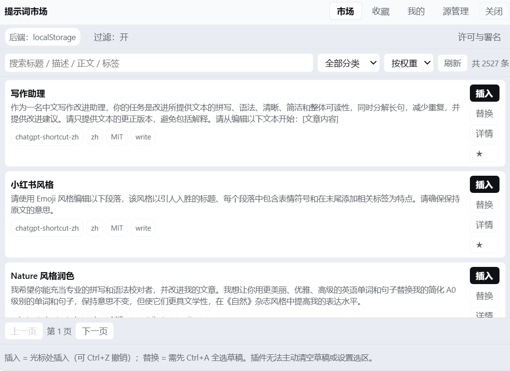
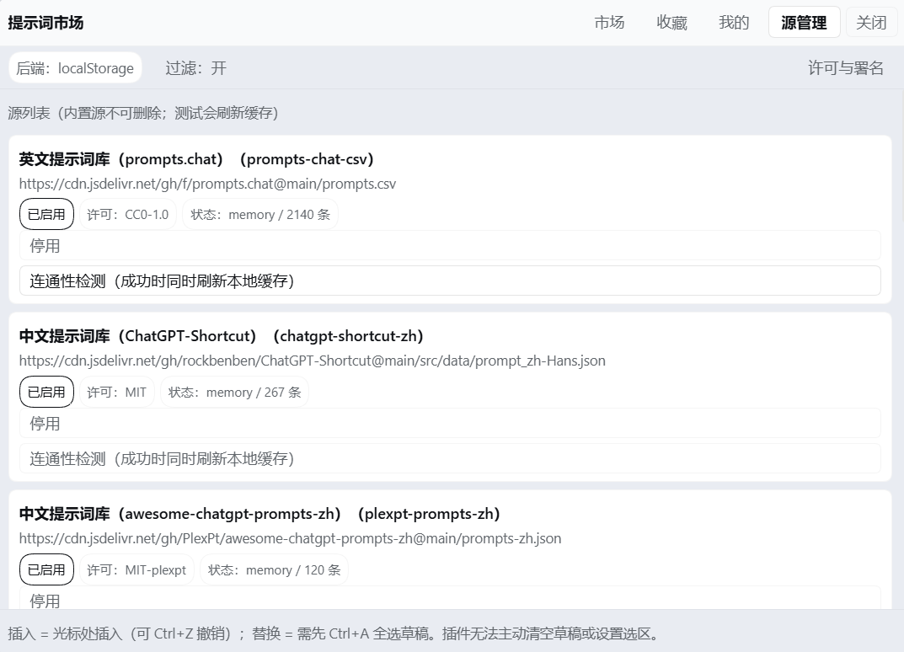
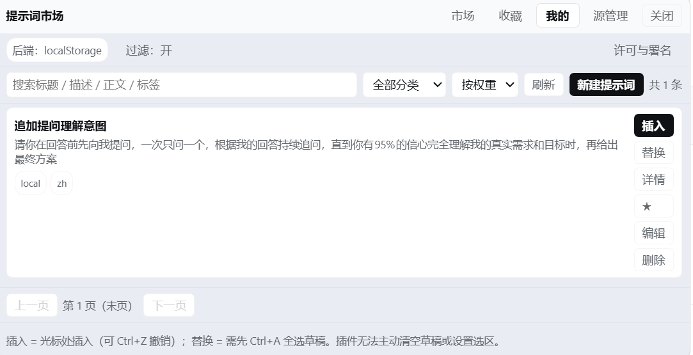
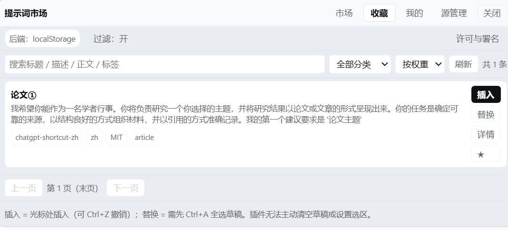
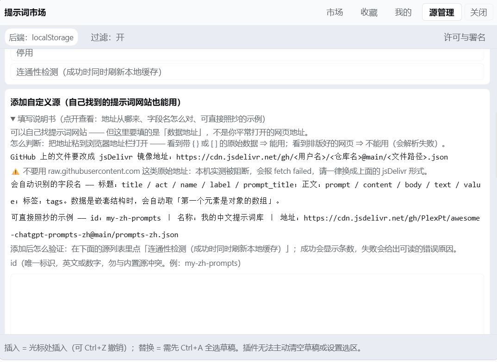
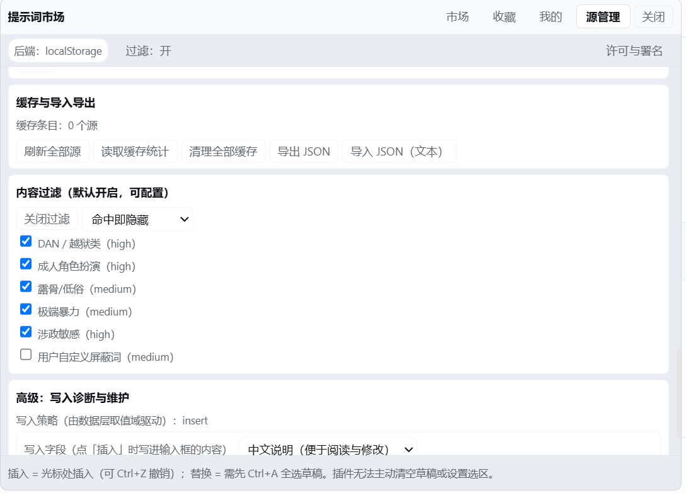
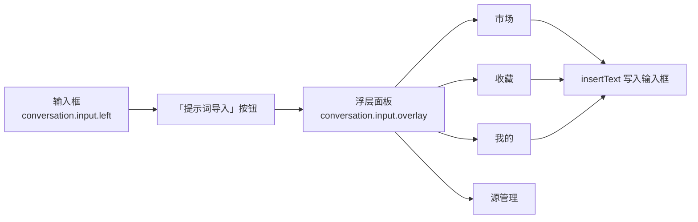
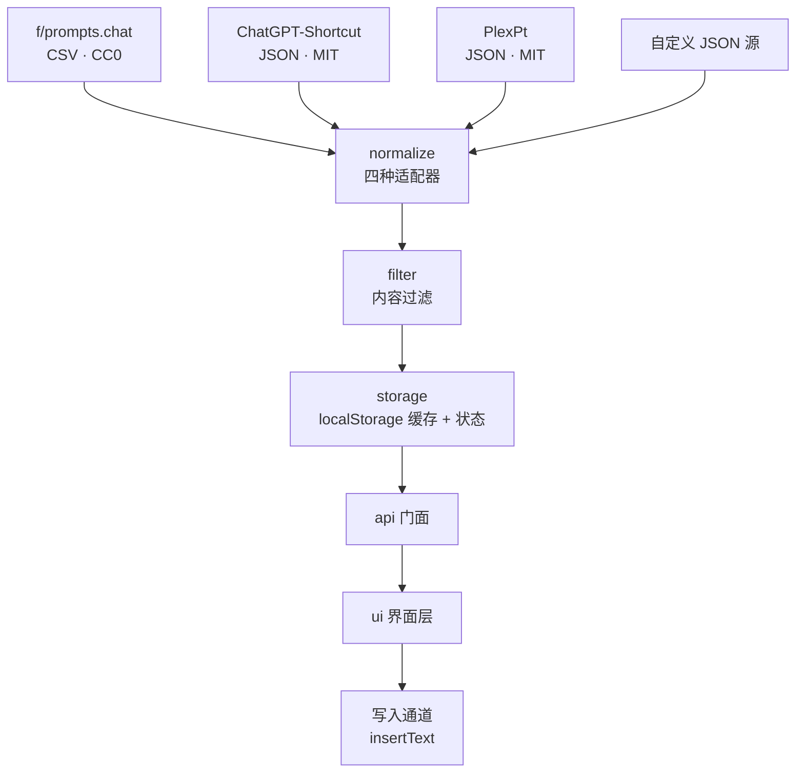

<div align="center">

# dsh-prompt-market

**DeepSeek Harness 提示词市场插件**

在对话框里一键浏览、搜索、收藏提示词 —— 选中即写入输入框

[](LICENSE)
[](CHANGELOG.md)
[](#安装)
[](#为什么可以没有构建步骤)
[](#数据与隐私)

[简体中文](README.md) | [English](README-en.md) | [日本語](README-ja.md)

</div>

---

## 目录

- [效果预览](#效果预览)
- [它解决什么问题](#它解决什么问题)
- [功能特性](#功能特性)
- [界面与架构](#界面与架构)
- [安装](#安装)
- [快速上手](#快速上手)
- [配置项](#配置项)
- [数据与隐私](#数据与隐私)
- [内置源与许可](#内置源与许可)
- [添加自定义源](#添加自定义源)
- [常见问题](#常见问题)
- [目录结构](#目录结构)
- [开发与自检](#开发与自检)
- [状态与已知限制](#状态与已知限制)
- [路线图](#路线图)
- [参与贡献](#参与贡献)
- [许可](#许可)

---

## 效果预览

### 市场：一个浮层里浏览、搜索、收藏



三个内置源合计 **2527 条**（已扣除内容过滤条数）。

顶部可搜索**标题 / 描述 / 正文 / 标签**，右侧可选分类与排序；每条右侧是「插入 / 替换 / 详情 / ★」。
底部实时显示当前列的来源、语言、许可与标签。

### 源管理：连通性、许可与署名一目了然



两处值得注意的细节：

- 「**状态**」列显示每个源实际加载了多少条 —— 连接失败会**如实报错**，不静默假装成功
- 「**许可**」列把两个 MIT 库**区分开**：一个是 `MIT`，另一个是 `MIT-plexpt`
  （**版权人不同的两个库，署名不混用**）

### 我的：自己写、自己改



自建提示词存在本机，可编辑、可删除、可导出带走。

### 收藏：随手取用



### 添加自定义源（带可折叠说明书）



说明书讲清了**怎么判断一个网址能不能用**（看到的必须是带 `{}` / `[]` 的原始数据，
而不是排版好的网页），并给出可直接照抄的示例。

### 内容过滤与写入诊断



内容过滤**默认开启**，六条规则可逐条开关、可加自定义屏蔽词；
「写入字段」可在**中文说明**与**英文原文**之间切换。

---

## 它解决什么问题

用 AI 写东西时，好用的提示词总是散落在浏览器书签、笔记、别人的聊天记录里。真要用的时候要么找不到，要么复制过来还得改半天。

这个插件把「**找提示词 → 用提示词**」压缩成两步：

```
点输入框左边的「提示词导入」  →  点某一条的「插入」
```

---

## 功能特性

| 模块 | 能力 |
|---|---|
| 🛒 **市场** | 三个内置源，支持搜索、分类筛选、分页、权重排序；显示来源与许可 |
| ⭐ **收藏** | 一键收藏 / 取消，收藏夹独立成页，随手可取 |
| ✍️ **我的** | 新建、编辑、删除自己的提示词，可打标签 |
| 🔌 **源管理** | 查看每个源的连通性与缓存条目；**添加任意 JSON 源**（附可折叠说明书）；显示许可与署名 |
| 🛡️ **内容过滤** | 默认开启，拦截越狱类与成人角色扮演条目；六条规则可逐条开关，支持自定义屏蔽词 |
| 💾 **导入导出** | 收藏 + 自建 + 标签 + 设置整体导出为 JSON，方便换机迁移 |
| 🈶 **中英可切** | **默认插入中文说明**，可在源管理中切换为英文原文 |

### 写入行为

- **默认插入中文说明**（`description`）—— 便于阅读和二次修改
- 可在「源管理 → 高级 → 写入字段」切换为**英文原文**（`prompt`）
- 插入走 `inputActions.insertText()`，因此**插入后可 `Ctrl+Z` 撤销**
- 输入框已有内容时，默认**插入到光标处**，不覆盖你已写的内容
- 想整段替换：先 `Ctrl+A` 全选草稿，再点「替换」

> ⚠️ **能力边界（如实说明）**
>
> 插件的 `InputActions` 只提供 `captureInsertion` / `insertText` / `setDraft`，**没有清空草稿或设置选区的能力**。
> 因此「替换整段」依赖用户手动全选 —— 插件**无法主动**清空你的草稿。
> 这是 DSH 当前接口的边界，不是本插件的取舍。

---

## 界面与架构

### 界面组成



界面挂在 DSH 的两个官方插槽上，不侵入对话区，也不改写其他插件的 UI。

### 数据流



**降级链**：网络失败 → 用本地缓存 → 缓存也没有 → 返回可展示的错误态，**不白屏、不抛未捕获异常**。

---

## 安装

### 前置

- DeepSeek Harness 桌面端
- 插件**运行时不依赖 Node**（Node 只在跑开发自检时需要）

### 方式一：命令行（推荐）

```cmd
dsh plugin --profile desktop add "<本仓库路径>\plugin"
```

`dsh` 不在 PATH 时，用 DSH 安装目录下的垫片：

```cmd
"<DSH 安装目录>\resources\runtime\cli\bin\dsh.cmd" plugin --profile desktop add "<本仓库路径>\plugin"
```

### 方式二：图形界面

在 DSH 的**设置 → 插件**页面里填写本仓库的 `plugin` 目录路径。

### 方式三：软链接（开发者）

```cmd
mklink /D "<DSH profile>\node_modules\dsh-prompt-market" "<本仓库路径>\plugin"
```

改代码后**只需重启 DSH，不用重装**。

> 🔄 **安装后必须完全退出并重新打开 DSH** —— profile 是启动期加载的。

### 验证安装

重启后，输入框左侧应出现「**提示词导入**」按钮，点开应有四个页签。

---

## 快速上手

1. 点输入框左侧「**提示词导入**」
2. 在「市场」页签搜索你想要的场景（如「写作」「翻译」「代码审查」）
3. 点某条右侧的「**插入**」—— 文本进入输入框
4. 按需补充细节，然后发送
5. 常用的点 ⭐ **收藏**，下次直接在「收藏」页签取
6. 自己常写的提示词，去「我的」页签**新建**保存

---

## 配置项

「源管理」页签内可调：

| 配置 | 默认 | 说明 |
|---|---|---|
| **写入字段** | 中文说明（`description`） | 可切换为英文原文（`prompt`） |
| **内容过滤** | 开启 | 拦截越狱类与成人角色扮演条目 |
| **过滤规则** | 六条全开 | 可逐条关闭 |
| **自定义屏蔽词** | 空 | 命中的条目会被过滤 |
| **每个源的启用状态** | 全部启用 | 可临时停用某个源 |
| **缓存有效期** | 见源码 `NET_DEFAULTS` | 过期后重新拉取 |

---

## 数据与隐私

| 项 | 说明 |
|---|---|
| **存储位置** | 浏览器 `localStorage`（键名前缀 `dsh-prompt-market:`） |
| **是否上传** | ❌ **不上传任何数据**，无账号、无服务端 |
| **是否写磁盘** | ❌ 不写（插件自身代码除外） |
| **数据损坏时** | 原数据移入 `quarantine` 留档，**不会直接清空** |
| **`localStorage` 不可用时** | 自动降级为内存模式（功能可用、重启即丢），界面会提示 |
| **诊断日志** | 只记录草稿的**长度与哈希**，不记录内容 |
| **请求去向** | 只请求你在源列表里看到的那些 URL（内置源默认走 `cdn.jsdelivr.net`） |

**卸载不会自动清掉数据** —— 需要清干净时在开发者工具里删除 `dsh-prompt-market:` 前缀的键。

---

## 内置源与许可

| 源 | 许可 | 说明 |
|---|---|---|
| [f/prompts.chat](https://github.com/f/prompts.chat) | **CC0 1.0** | 英文经典提示词库，公有领域 |
| [rockbenben/ChatGPT-Shortcut](https://github.com/rockbenben/ChatGPT-Shortcut) | **MIT** | 中文库；`prompt` 多为英文原文，中文在 `description` |
| [PlexPt/awesome-chatgpt-prompts-zh](https://github.com/PlexPt/awesome-chatgpt-prompts-zh) | **MIT** | 纯中文库，标题与正文均为中文 |

完整的版权行与许可正文见 **[THIRD-PARTY-NOTICES.md](THIRD-PARTY-NOTICES.md)**。

> 📌 **内容不随包分发。** 插件在运行时从 CDN 拉取这些源的数据并缓存在用户本机；
> 本仓库**不包含**任何上游提示词内容。

---

## 添加自定义源

「源管理 → 添加自定义源」里填入任意返回 **JSON 数组**的地址，插件会自动识别常见字段名：

| 用途 | 自动识别的字段名 |
|---|---|
| 标题 | `title` / `act` / `name` / `label` / `prompt_title` |
| 正文 | `prompt` / `content` / `body` / `text` / `value` |
| 标签 | `tags` |
| 嵌套结构 | 自动取「第一个元素是对象的数组」，也可指定 `listPath` |

**GitHub 上的 JSON 请用 jsDelivr 镜像**（`raw.githubusercontent.com` 在部分网络环境不可达）：

```
https://cdn.jsdelivr.net/gh/<用户名>/<仓库名>@main/<文件路径>.json
```

> 添加页里有**可折叠的详细说明书**，讲清了判据、示例与常见坑。

---

## 常见问题

<details>
<summary><b>插入的是英文，我看不懂</b></summary>

默认插入的其实是**中文说明**。若某些条目的中文说明为空，插件会回落到英文原文。

可以在「源管理 → 高级 → 写入字段」确认当前设置；也可以在「我的」里把它改写成中文后保存。
</details>

<details>
<summary><b>输入框里已有内容，插入会覆盖吗？</b></summary>

**不会。** 默认插入到光标处，你已写的内容保留。

想整段替换：先 `Ctrl+A` 全选草稿，再点「替换」。
</details>

<details>
<summary><b>插错了能撤回吗？</b></summary>

**可以，`Ctrl+Z`。** 插入走的是 DSH 官方承诺「可撤销的纯文本编辑」的那条通道。
</details>

<details>
<summary><b>关掉面板，我写了一半的草稿还在吗？</b></summary>

**在。** 面板是浮层，不会动你的草稿。
</details>

<details>
<summary><b>这个插件会联网上传我的东西吗？</b></summary>

**不会。** 它只向源列表里的地址发 GET 请求来拉取提示词数据；你的收藏、自建、草稿等内容**从不离开本机**。
诊断日志里只记长度和哈希，不记内容。
</details>

<details>
<summary><b>加了自定义源，但一条都读不出来</b></summary>

按顺序检查：

1. 地址返回的是**JSON 数组**吗？（不是对象、不是 HTML 页面）
2. 用了 `raw.githubusercontent.com` 吗？换成 `cdn.jsdelivr.net` 镜像
3. 字段名在自动识别列表里吗？不在的话在源配置里指定 `listPath`
4. 条目是不是被**内容过滤**挡掉了？（源管理里能看到过滤计数）
</details>

<details>
<summary><b>某一条提示词被误过滤了</b></summary>

去「源管理 → 内容过滤」，逐条关闭规则，或把该条的关键词从自定义屏蔽词里去掉。
</details>

<details>
<summary><b>换电脑后收藏还在吗？</b></summary>

用「导入导出」把数据导出成 JSON 带走，在新机器上导入即可。数据存在浏览器 `localStorage` 里，不跟随账号。
</details>

<details>
<summary><b>卸载后我的收藏会没吗？</b></summary>

不会自动删除（`localStorage` 独立于插件）。想清干净就在开发者工具里删掉 `dsh-prompt-market:` 前缀的键。
</details>

---

## 目录结构

```
plugin/                      ← 安装目标（DSH 只加载这里）
├── package.json             包元数据：dsh.bundle.patch + dsh.client
├── cordis.patch.yml         profile 层补丁（一行 insert 挂载本插件）
├── index.js                 Host 半身（ESM）
├── client.js                ★ 浏览器半身（装配产物，DSH 唯一加载的客户端入口）
├── core/                    数据层
│   ├── *.js                 9 个可独立阅读的单元
│   ├── browser.js           浏览器半身成品源码（免构建，可直接内联）
│   ├── selftest-node.js     数据层自检（Node 运行）
│   └── check-data-layer.ps1 静态自检（无需 JS 运行时）
├── ui/                      界面层
│   ├── 00-core.js … 80-client-shell.js
│   ├── check-ui.ps1         界面静态自检
│   └── DESIGN.md            界面设计契约
└── lib/write-draft.js       低层写入封装（仅探针 / 诊断用）
```

### 为什么可以没有构建步骤

`client.js` 由 `core/browser.js` 的 **9 个数据单元** + `ui/` 的 **8 个界面单元**，
按 `ui/80-client-shell.js` 模板**装配**而成。

界面代码是手写的 `window.__ModuleLoader__.load({ id, factory })` 形式 ——
**没有打包器、没有 JSX、没有 TypeScript**，源码即产物。因此装配结果也纳入了版本控制。

---

## 开发与自检

```cmd
:: 语法检查（覆盖 plugin 下全部 .js）
node diag-syntax.js

:: 权威判据：装配区段 ↔ browser.js 单元区段，逐行一致
node plugin/core/build-client-bundle.js --check

:: 数据层自检（真跑算法）
node plugin/core/selftest-node.js

:: 界面静态自检
powershell -NoProfile -ExecutionPolicy Bypass -File plugin/ui/check-ui.ps1
```

> ⚠️ **一致性判据只看「区段对区段」**：`client.js` 的 `PM-CORE-INLINE` 区段 ↔
> `browser.js` 的单元区段，逐行一致（忽略行首缩进与空行）。
> **不要**拿 `client.js` 整文件去比 `browser.js` 整文件（前者是装配产物、含壳层与 UI 区，长度本就无关），
> 也**不要**拿 `browser.js` 去比 `plugin/core/*.js`（单元体是精简重写版，逐行 diff 必然误报）。

---

## 状态与已知限制

本项目经过独立评审（三轮，阻塞项已全部闭合）与真机实测。以下是**如实声明**：

### ✅ 已实测（真机运行确认）

按钮可见 · 面板四页签 · **插入为中文** · **写入后可发送** · **关面板草稿保留** ·
**`Ctrl+Z` 可撤销** · 写入字段切换 · 详情关闭 · 自定义源说明书 · **许可与署名分源呈现** ·
打包可安装性（`pack.ps1` / `verify-package.ps1` 退出码 0）· 各静态自检退出码 0 ·
**三个内置源逐条解析** —— 原始条数 `prompts-chat-csv` **2165** / `chatgpt-shortcut-zh` **279** /
`plexpt-prompts-zh` **124**，扣除内容过滤后为 **2140 / 267 / 120**，合计 **2527**

> 最后一项由**两条独立路径互相印证**：Node 侧实跑数据层（`verify-sources.js`），
> 与真机界面显示的条数完全吻合。

### 🟨 未实测（设计正确，但未取得运行期证据）

断网降级 · 重启后收藏与自建持久化 · 内容过滤对真实中文条目的运行期生效 · 条件「替换」动作

> 这些**不是「有问题」，而是「没验证过」**。我们不把它们写成「已验证」。

### 🔴 交付后发现并修复的真实缺陷

| 缺陷 | 后果 | 状态 |
|---|---|---|
| 远程响应体上限 **4 MB** 太小，而内置英文源的 CSV 实际 **5.5 MB**，被整包丢弃 | **英文源一条都读不出来（0 条）** —— 三个内置源坏了一个 | ✅ 已修复（上限放宽至 12 MB）；真机确认恢复为 **2140 条** |

> 这个缺陷**恰好落在上面「未实测」清单里**（原「三个源逐条解析的完整性」一项），
> 而且**是由用户的真机截图发现的，不是由任何自检脚本发现的**。
>
> 原代码注释写着「防止 8 MB 级文件把编辑器拖死；已决定避开」——
> 也就是说，设计时**假定内置源都是小文件**。这个假设被运行期证据推翻了。
>
> **这就是「未实测」三个字的真实含义：它不是「大概没问题」，而是「可能真的坏着」。**

### 已知限制

| 编号 | 内容 |
|---|---|
| L1 | `selftest-node.js` 含一条约 78 秒的用例（生产默认超时预算不可注入，未改核心） |
| L2 | 个别自检断言在缺少 `localStorage` 的环境下需复跑定案 |
| L3 | `plugin/client.js` 保留 2 行装配模板占位注释，界面自检 `A14` 报 **WARN**（非 FAIL，无功能影响） |
| L4 | 「替换整段」依赖用户手动 `Ctrl+A` —— 受 DSH `InputActions` 接口边界限制 |

---

## 路线图

- [ ] 提示词变量填充（`{{变量}}` 占位与填写面板）
- [ ] 收藏分组 / 文件夹
- [ ] 支持 Gitee 及任意 CORS 友好的 JSON 源
- [ ] 内置源可增删排序
- [ ] 界面自检 `A14` 的 WARN 清零（与下一次装配一并处理）

> 路线图是**计划**，不是承诺。有优先级需求请开 issue。

---

## 参与贡献

欢迎 issue 与 PR，请先读 [CONTRIBUTING.md](CONTRIBUTING.md)。

**特别欢迎**：

- 🐛 报告**未实测清单**里那些场景的实测结果（无论通过还是失败，都有价值）
- 🌐 补充内置提示词源（请附上**上游许可**与**版权人**）
- 🌍 翻译 README（目前有中文、英文、日文）

---

## 许可

本插件代码以 **MIT** 发布，见 [LICENSE](LICENSE)。

内置数据源的许可与署名见 [THIRD-PARTY-NOTICES.md](THIRD-PARTY-NOTICES.md) ——
**分发或修改本插件时请一并保留。**

<div align="center">

**如果这个插件帮到了你，给个 ⭐ 是最好的支持**

</div>
